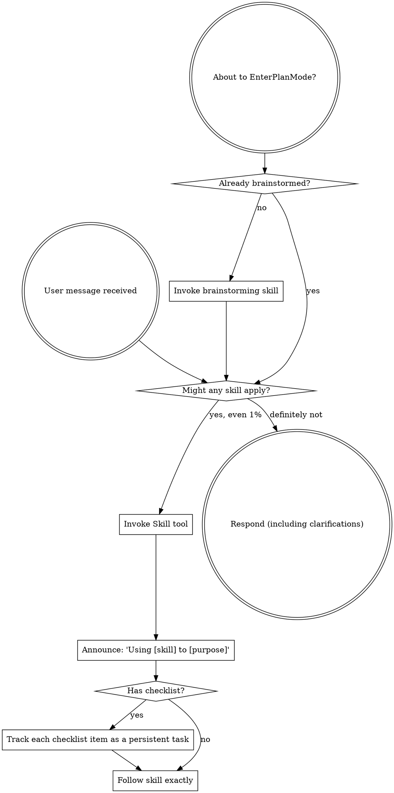

# Bootstrap Transition Implementation Plan

> **For agentic workers:** REQUIRED SUB-SKILL: Use superslow:subagent-driven-development to implement this plan task-by-task. Steps use checkbox (`- [ ]`) syntax for tracking.

**Goal:** Transition foundational instructions from the `using-superpowers` skill to a repository-level `bootstrap.md` file.

**Architecture:** Move skill content to root, delete skill, update all session-start injection points (Gemini instructions, Claude/Cursor hooks, OpenCode plugin) to use the new file.

**Tech Stack:** Bash, JavaScript (Node.js), Markdown.

---

### Task 1: Create bootstrap.md and migrate content

**Files:**
- Create: `bootstrap.md`
- Delete: `skills/using-superpowers/`

- [ ] **Step 1: Read the current skill content**

Run: `cat skills/using-superpowers/SKILL.md`

- [ ] **Step 2: Create bootstrap.md with migrated content**

Strip frontmatter and `<SUBAGENT-STOP>` block. Update framing.

```markdown
# Instructions for using Superpowers Skills

<EXTREMELY-IMPORTANT>
If you think there is even a 1% chance a skill might apply to what you are doing, you ABSOLUTELY MUST invoke the skill.

IF A SKILL APPLIES TO YOUR TASK, YOU DO NOT HAVE A CHOICE. YOU MUST USE IT.

This is not negotiable. This is not optional. You cannot rationalize your way out of this.
</EXTREMELY-IMPORTANT>

## Instruction Priority

Superpowers skills override default system prompt behavior, but **user instructions always take precedence**:

1. **User's explicit instructions** (CLAUDE.md, GEMINI.md, AGENTS.md, direct requests) — highest priority
2. **Superpowers skills** — override default system behavior where they conflict
3. **Default system prompt** — lowest priority

## How to Access Skills

Skills are invoked through your platform's dedicated skill mechanism — whatever your host exposes for loading a skill by name. Use it. **Do not open skill files as plain text** — the raw markdown bypasses the loader's framing, prerequisite chains, and session state.

## Tool Vocabulary

Skills describe capabilities, not tool names. Map each capability to whatever tool your platform provides.

# Using Skills

## The Rule

**Invoke relevant or requested skills BEFORE any response or action.** Even a 1% chance a skill might apply means that you should invoke the skill to check.



## Red Flags

These thoughts mean STOP—you're rationalizing:

| Thought | Reality |
|---------|---------|
| "This is just a simple question" | Questions are tasks. Check for skills. |
| "I need more context first" | Skill check comes BEFORE clarifying questions. |
| "Let me explore the codebase first" | Skills tell you HOW to explore. Check first. |
| "I can check git/files quickly" | Files lack conversation context. Check for skills. |
| "Let me gather information first" | Skills tell you HOW to gather information. |
| "This doesn't need a formal skill" | If a skill exists, use it. |
| "I remember this skill" | Skills evolve. Read current version. |
| "This doesn't count as a task" | Action = task. Check for skills. |
| "The skill is overkill" | Simple things become complex. Use it. |
| "I'll just do this one thing first" | Check BEFORE doing anything. |
| "This feels productive" | Undisciplined action wastes time. Skills prevent this. |
| "I know what that means" | Knowing the concept ≠ using the skill. Invoke it. |

## Skill Priority

When multiple skills could apply, use this order:

1. **Process skills first** (brainstorming, debugging)
2. **Implementation skills second** (frontend-design, mcp-builder)

## Skill Types

**Rigid** (TDD, debugging): Follow exactly.

**Flexible** (patterns): Adapt principles to context.

## User Instructions

Instructions say WHAT, not HOW. "Add X" or "Fix Y" doesn't mean skip workflows.
```

- [ ] **Step 3: Remove the old skill directory**

Run: `rm -rf skills/using-superpowers`

- [ ] **Step 4: Commit**

Run: `git add bootstrap.md && git rm -r skills/using-superpowers && git commit -m "feat: migrate using-superpowers skill to bootstrap.md"`

### Task 2: Update Gemini CLI instructions

**Files:**
- Modify: `gemini-instructions.md`

- [ ] **Step 1: Update the import directive**

Change:
```markdown
@./skills/using-superpowers/SKILL.md
```
To:
```markdown
@./bootstrap.md
```

- [ ] **Step 2: Commit**

Run: `git add gemini-instructions.md && git commit -m "chore(gemini): update bootstrap import path"`

### Task 3: Update Claude / Cursor / Codex hooks

**Files:**
- Modify: `hooks/session-start`

- [ ] **Step 1: Update the file path and framing**

Change:
```bash
using_superpowers_content=$(cat "${SKILLS_DIR}/using-superpowers/SKILL.md" 2>&1 || echo "Error reading using-superpowers skill")
```
To:
```bash
using_superpowers_content=$(cat "${SCRIPT_DIR}/../bootstrap.md" 2>&1 || echo "Error reading bootstrap instructions")
```

Change:
```bash
session_context="<EXTREMELY_IMPORTANT>\nYou have superpowers.\n\n**Below is the full content of your 'superslow:using-superpowers' skill - your introduction to using skills. For all other skills, use the 'Skill' tool:**\n\n${using_superpowers_escaped}\n</EXTREMELY_IMPORTANT>"
```
To:
```bash
session_context="<EXTREMELY_IMPORTANT>\nYou have superpowers.\n\n**Below are your core instructions for using skills. For all other skills, use the 'Skill' tool:**\n\n${using_superpowers_escaped}\n</EXTREMELY_IMPORTANT>"
```

- [ ] **Step 2: Commit**

Run: `git add hooks/session-start && git commit -m "chore(hooks): update bootstrap path and framing"`

### Task 4: Update OpenCode plugin

**Files:**
- Modify: `opencode/plugins/superpowers.js`

- [ ] **Step 1: Update path and remove frontmatter extraction**

Modify `usingSuperpowersSkillPath`:
```javascript
const usingSuperpowersSkillPath = path.join(
  superpowersSkillsDir,
  "using-superpowers",
  "SKILL.md",
);
```
To:
```javascript
const usingSuperpowersSkillPath = path.resolve(__dirname, "../../bootstrap.md");
```

Modify `getBootstrapContent` to skip `extractAndStripFrontmatter`:
```javascript
    const fullContent = fs.readFileSync(usingSuperpowersSkillPath, "utf8");
    const { content } = extractAndStripFrontmatter(fullContent);
```
To:
```javascript
    const content = fs.readFileSync(usingSuperpowersSkillPath, "utf8");
```

Modify the `_bootstrapCache` framing:
```javascript
**IMPORTANT: The using-superpowers skill content is included below. It is ALREADY LOADED - you are currently following it. Do NOT use the skill tool to load "using-superpowers" again - that would be redundant.**
```
To:
```javascript
**IMPORTANT: Your core instructions are included below. They are ALREADY LOADED - you are currently following them. Do NOT look for a 'using-superpowers' skill - it has been integrated here.**
```

- [ ] **Step 2: Commit**

Run: `git add opencode/plugins/superpowers.js && git commit -m "chore(opencode): update bootstrap path and framing"`

### Task 5: Update Tests and Documentation

**Files:**
- Modify: `tests/opencode/test-opencode-git-install.sh` (or any failing tests found during `bun test`)
- Modify: `README.md`

- [ ] **Step 1: Update OpenCode tests**

Search for `using-superpowers` in `tests/` and update to `bootstrap.md`.

- [ ] **Step 2: Update README.md**

Remove `using-superpowers` from the skills list.

- [ ] **Step 3: Run all tests**

Run: `bun test` and verify harness-specific tests if possible.

- [ ] **Step 4: Commit**

Run: `git add . && git commit -m "chore: update tests and docs for bootstrap transition"`
